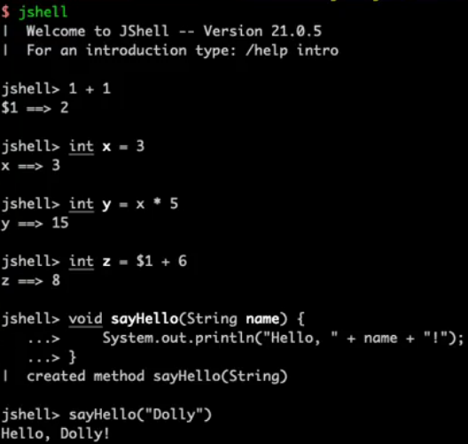
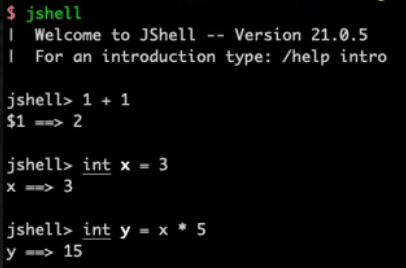
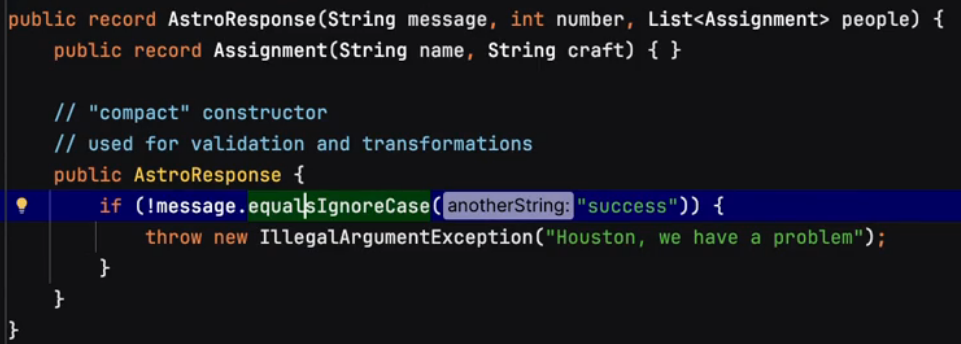
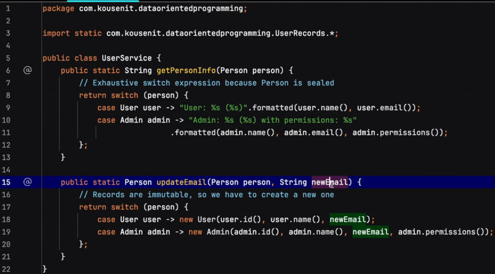
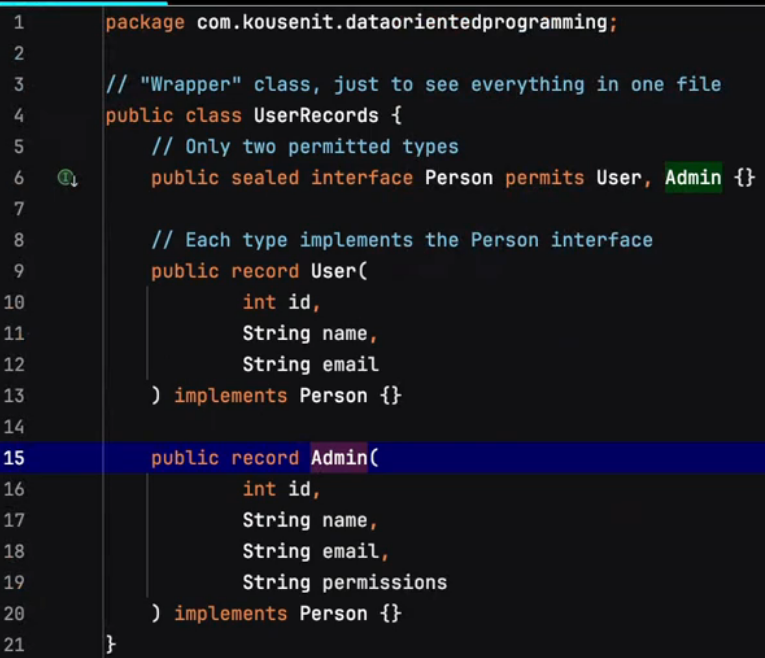
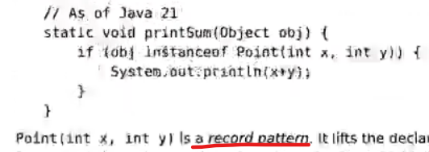
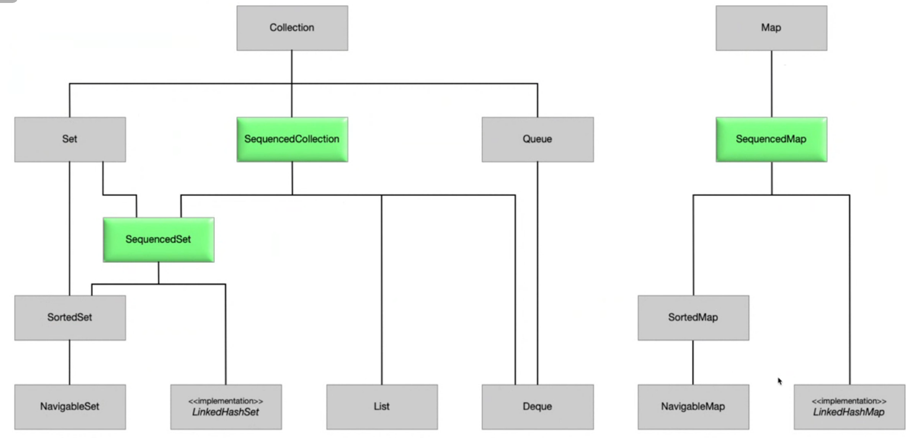

# Introduction
This project contains the main features of Java LTS versions released by Oracle. Some features are introduced in minor version of JDK. The sample code of these features can be found in the next LTS version of the JDK.

# JEP status
- status: preview and incubator

# JDK Features List Source
You can check all the features released or in trial from this link: https://openjdk.org/projects/jdk/

Good comparison of JDK versions: https://javaalmanac.io/

# LTS Features
## JDK 11
### 1. Collection Factory Methods (JDK 9)
Characteristics of these list/set/map: 
- unmodifiable: cannot add, remove, or replace any of the elements in the list --> UnsupportedOperationException. NOTE: mutable elements can still be updated.
- cannot have null elements --> NullPointerException
- serializable if all the elements are
- set.of() does not allow duplicates

### 2. Local Variable Type Inferencing (LVTI) - var (JDK 10-11) 
var ==> 'reserved type name', NOT a keyword --> simply to avoid duplication in typing
Characteristics:
- local variable ONLY
- cannot be assigned to null
- cannot be method's parameter
- 

### 3. HTTPClient (JDK 11)

### 4. HTTP2Client (JDK 11)

### 5. JShell (JDK 9)
- added to your JDK installation folder
- $ jshell
- jshell> exit --> to leave
- No ; needed 
- jshell> / --> list of commands
- jshell> /list --> list all executed commands
- jshell> /imports --> list all included imports

### 6. Single-File Source-Code Programs
- Run java program directly using java command without the compilation step (javac)
- Run java program from an executable (-x permission) shebang file: #!/path/to/java --source version. NOTE: JDK 22 allows multiple source

### 7. Enhanced switch expression (JDK 14)
- expression: returns a value
- Use ->, not ;
- No fall through --> must be exhaustive, i.e. every possible value must be covered --> use 'default'
- Use 'yield' to return to block only

### 8. Text Blocks (JDK 15)
- Multi-line String
- Use """
- Very useful when writing json data or sql lines

### 9. Records (JDK 16)
- use of compact constructor for members validation and transformation purposes:

### 10. Module system (JDK 9)
- file module-info.java
- true encapsulation
- 

## JDK 17
### 1. Sealed classes/interface (JDK 17)
- A sealed parent class specifies who can extend it using 'permits'.
- Children's modifiers MUST be: 'sealed', 'non-sealed', or 'final'
- Children are open unless final
- All classes must be in the same module. If unnamed module, same package.
- Below shows a good sample case of using sealed classes with pattern matching as there are only 2 possible records: user or admin

## JDK 21
### 1. Pattern matching (JDK 16, 21)
- instanceof

### 2. Record Patterns (JDK 21)
- sample:

### 3. Sequenced Collections (JDK 21)

### 4. Virtual Threads (JDK 21)
- VT = light-weight threads