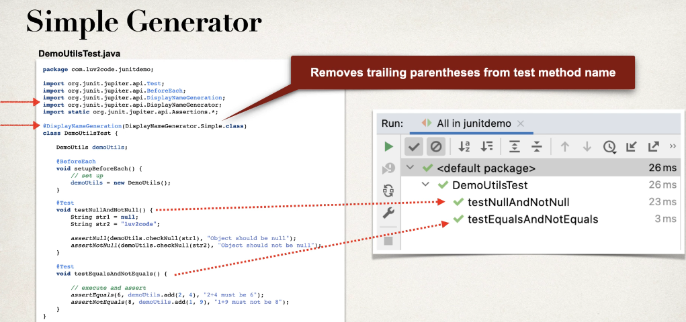
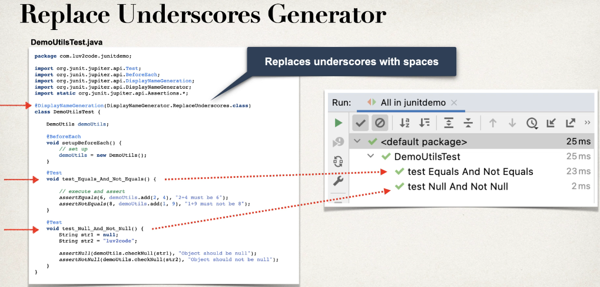
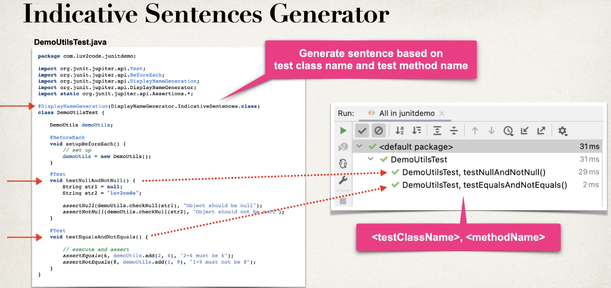
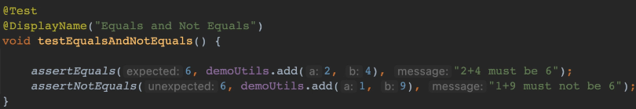

# Approval/Characterisation Testing
Good introduction on approval/characterisation testing [here](https://www.youtube.com/watch?v=jAMVtMesHqk) and [here](https://www.youtube.com/watch?v=5H2s1knHUlA).
Living documentation using Approvals framework (definitely worth looking at!) is shown [here](https://www.youtube.com/watch?v=QEdpE0chA-s)

# Refactoring Legacy Code
Good course on this [here](https://courses.cd.training/courses/take/refactoring-tutorial/texts/22765099-about-this-course).
Summary of the course is shown below.
## Summary of Steps to Refactoring Legacy Code
Legacy code can mean old codes without unit tests.

4 steps to Refactoring Legacy Code:
1. ***Approval Testing***: get the reference result with good code coverage to make sure all scenarios are covered
2. Start refactoring by **removing clutters**: use Version Control to commit each of these actions in small incremental steps: removing dead code, renaming for better clarity, etc. Rerun approval test for no-behavioural change introduced.
3. **Reduce cyclomatic complexity** and **compose methods** by method extraction. Cyclomatic complexity: different path the code can go through (by ifs-else, etc). Rerun approval test to make sure no behavioural changes is introduced. Also, possibly create interface to put a level of abstraction in the code so SOLID principle is respected.
4. Create **more tests** to cover all scenarios, copy the result as reference result.

# TDD
JUnit5 useful annotations and assertions:
- @DisplayNameGeneration(DisplayNameGenerator.Simple.class)
    
    
    
- @DisplayName
    
- assertSame(expected, actual, msg), assertNotSame(e, a, m): checks if e and a are referring to the same object.
- assertTrue(e, a, m), assertFalse(e, a, m)
- 

# BDD
Source: [Cucumber School](https://school.cucumber.io/courses/take/bdd-with-cucumber-java/lessons/9489215-introduction-to-bdd)  

3 practices of BDD: Discovery -> Formulation -> Automation  
Discovery: discover scope of the behaviour required by the story (by Three Amigos) and turning the unknown-unknowns to known-unknowns by asking questions 'what if...'.  
Formulation: formulate the specification in business-readable language (Gherkin: Feature-Scenario-Given-When-Then). Each example is formulated into a scenario.
Automation: automate the formulated specification to verify the system's behaviour.  

BDD is a collaborative activity. Living documentation is a secondary, valuable, output of applying BDD practices.  

BDD and Agile: BDD is a collection of practices that build upon agile ways of working, helping teams succeed. For these practices to deliver value, you'll need to be working in an agile way.  

Living documentation: the documentation automatically tells us when it's out of sync with the behaviour of the application.  

User Stories help a team to do BDD: User stories were created to be "placeholders for a conversation." They allow us to defer detailed analysis until we're confident that the behaviour they describe actually needs to be developed. User stories often comes with acceptance criteria.  

Three Amigos: to ensure that the team fully understand the scope of the story being discussed, e.g. Product Owner (for representing the customer/business perspective), Developer (for representing development perspective), and Tester (for representing test perspective).  

## Gherkin keywords
Scenario == the example  
Given == the context: a specific state ready for the scenario to unfold  
When == the action: done to the system that causes the system produces an outcome  
Then == the outcome: the system's expected behaviour responding to the action happens in the context.  

Each line in a Scenario that begins with Given/When/Then is called a ***step***. We have to tell Cucumber what to do with these steps by providing ***step definitions*** as Java code with annotations @Given, @When, and @Then respectively.

## Best way to get started with Cucumber
Use a template proejct from [Github here](https://github.com/cucumber/cucumber-java-skeleton/tags). Download the zipped tag release and unzip it. Sample v5.6.0 is available in this folder.  

When the project is opened in IntelliJ, IntelliJ will normally suggest the Cucumber and Gherkin plugins to be installed and configured as shown below:  
  

### Sample project 'shouty'
See sample project 'shouty'.  

Create your Feature files (*.feature) as below:  
  
NOTE: best to keep the name of the feature file same as the feature.

hear_shout.feature:  
```
Feature: Hear shout
  Scenario: Listener is within range
    Given Lucy is located 15 metres from Sean
    When Sean shouts "free bagels at Sean's"
    Then Lucy hears Sean's message
```

Run the project: `$ mvn clean test`  
  

You will find some 'undefines' (red) and the provided definitions (yellow) :  
  

### Cucumber Expression
It's a simplified version of Regex used in G/W/T annotations. Regex can still be used. It is Java String.

Simple example of Cucex is the string element inside @Given: `@Given("Lucy is located 15 metres from Sean")`  

Capturing parameters: {int}, {float}, {word}, {String}. E.g.:  `@Given("Lucy is located {int} metres from Sean")`

Flexibility: you can add (s) in metre to include 1 metre or x metres. Also you can use / as alternative.E.g.: `@Given("Lucy is located/standing {int} metre(s) from Sean")`. In this case located or standing any distance away will be a match.  

To create your own parameter type, use Cucumber's annotation `@ParameterType("<text to match in Gherkin step>")` with the method name = the parameter name. E.g.:  
```
public class StepDefinitions {
  @Given("{person} is located {int} metres from Sean")    
  public void lucy_is_located_metres_from_Sean(Person person, Integer distance) { ... }
  ...
}
```
```
public class ParameterTypes {
  @ParameterType("Lucy|Sean")
  public Person person(String name) { return new Person(name); }
  ...
}
```


