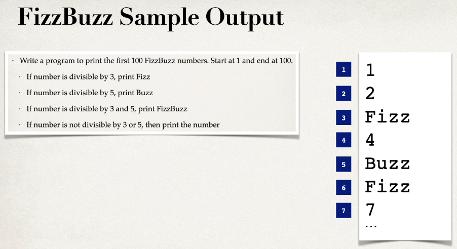
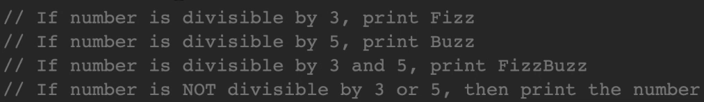

This is my own implementation of FizzBuzz project from Udemy course by Chad Darby titled [Develop Real-Time Spring Boot 3 Unit Tests: JUnit 5, Mockito, MockMvc, TDD, JsonPath, Hamcrest, H2 Embedded DB, MySQL](https://ba.udemy.com/course/spring-boot-unit-testing/learn/lecture/30872020?learning_path_id=8694787#overview).

